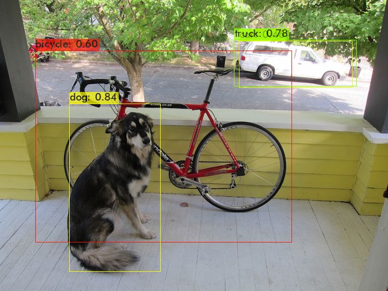

## 🖼️ Projeto 04 — Detecção de Objetos com YOLOv4 Tiny  

[](https://www.python.org/)    [](https://opencv.org/)    [](https://pjreddie.com/darknet/yolo/)  

> Quarto projeto do **Bootcamp Machine Learning** da [DIO](https://www.dio.me/) em parceria com a **BairesDev**.  
> Aplicação prática de **detecção de objetos** utilizando a rede **YOLOv4 Tiny** e o **dataset COCO**.

---

## 📌 Sobre o Projeto  

Este projeto demonstra como treinar e testar a rede YOLOv4 Tiny em imagens externas utilizando Google Colab.  

**O notebook realiza:**  

1. Configuração do ambiente e instalação de dependências.  
2. Preparação do dataset COCO (subconjunto para teste rápido).  
3. Ajuste da configuração da rede para classes customizadas.  
4. Treinamento rápido da rede para testes.  
5. Inferência em imagens externas com exibição de caixas delimitadoras.  

**Objetivos do projeto:**  

- Treinar YOLOv4 Tiny de forma rápida e eficiente.  
- Testar detecção de objetos em imagens externas.  
- Permitir execução em GPU ou CPU no Colab.

---

## 🛠️ Tecnologias e Ferramentas  

- **Python 3.10+** ([link](https://www.python.org/))  
- **OpenCV 4.5.4** → Processamento e exibição de imagens  
- **YOLOv4 Tiny** → Rede de detecção de objetos rápida e leve  
- **Google Colab** → Ambiente de execução  

---

## 📂 Estrutura do Projeto  

```text
projeto-04-treinamento-rede-yolo/
├── LICENSE                              # Arquivo de licença MIT
├── README.md                            # Este arquivo
├── predictions.jpg                      # Imagem de teste com detecções
└── projeto_04_treinamento_rede_yolo.py  # Script principal com todo o código
```

---

## 📊 Resultados

O notebook permite:

Treinamento rápido da rede YOLOv4 Tiny.

Inferência em imagens externas.

Visualização de imagens com boxes de detecção, caso existam objetos detectados.

Observação: Para imagens sem objetos correspondentes às classes treinadas, a imagem será exibida sem boxes. 



---

## 🚀 Como Executar

```bash
# Clone o repositório
git clone https://github.com/rodrigoulart/projeto-04-treinamento-rede-yolo.git

# Acesse a pasta do projeto
cd projeto-04-treinamento-rede-yolo

# Execute o notebook ou script principal no Colab
```

O  programa irá:  

Executar os blocos para instalar dependências, baixar dataset COCO e preparar arquivos de treino/validação.

Treinar a rede com um subconjunto do dataset para testes rápidos.

Testar imagens externas. Alterando o caminho no bloco de inferência, é possível testar novas imagens.

[Imagem de exemplo](https://images.unsplash.com/photo-1595433562696-209c6b7a0d55)

---

## 📚 Conceitos Aplicados

YOLO (You Only Look Once) → Rede de detecção de objetos em tempo real.

Treinamento rápido → Uso de batch reduzido e subset do dataset.

Dataset COCO → Conjunto padrão de imagens para detecção de objetos.

Inferência em GPU ou CPU → Flexibilidade para execução no Colab ou outros ambientes.

---

## 🏆 Créditos

Desenvolvido por Rodrigo Moraes, como projeto de estudo no Bootcamp Machine Learning da DIO em parceria com a BairesDev.

📎 Repositório: https://github.com/rodrigoulart/projeto-4-treinamento-rede-yolo


